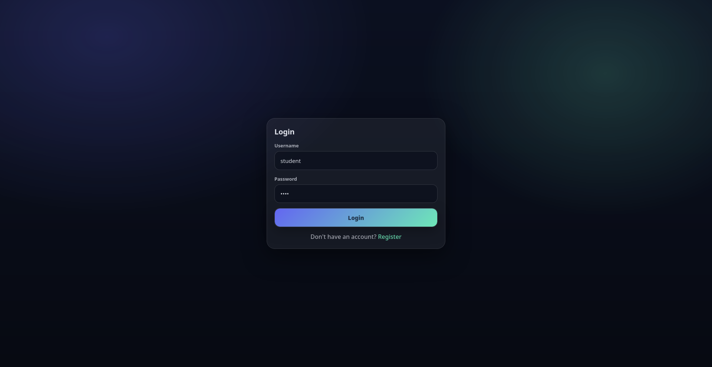
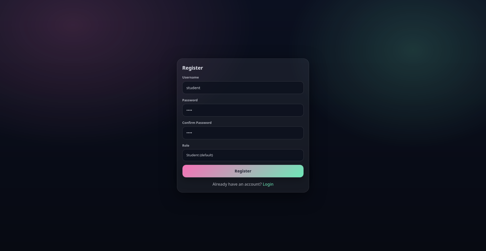
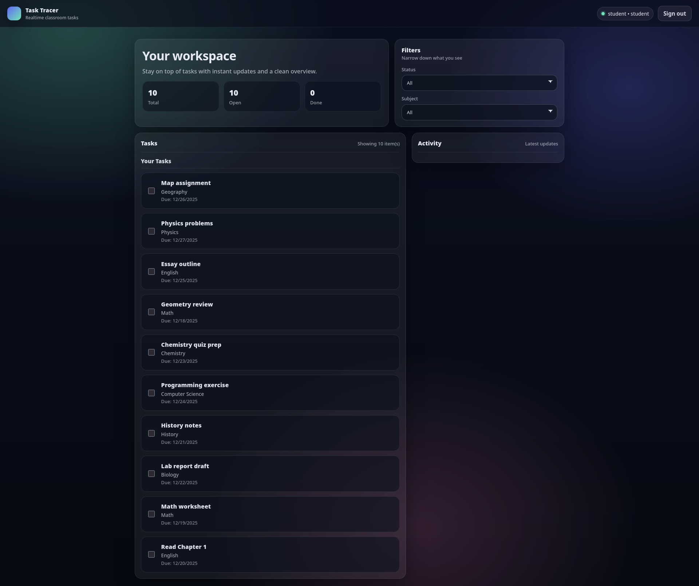
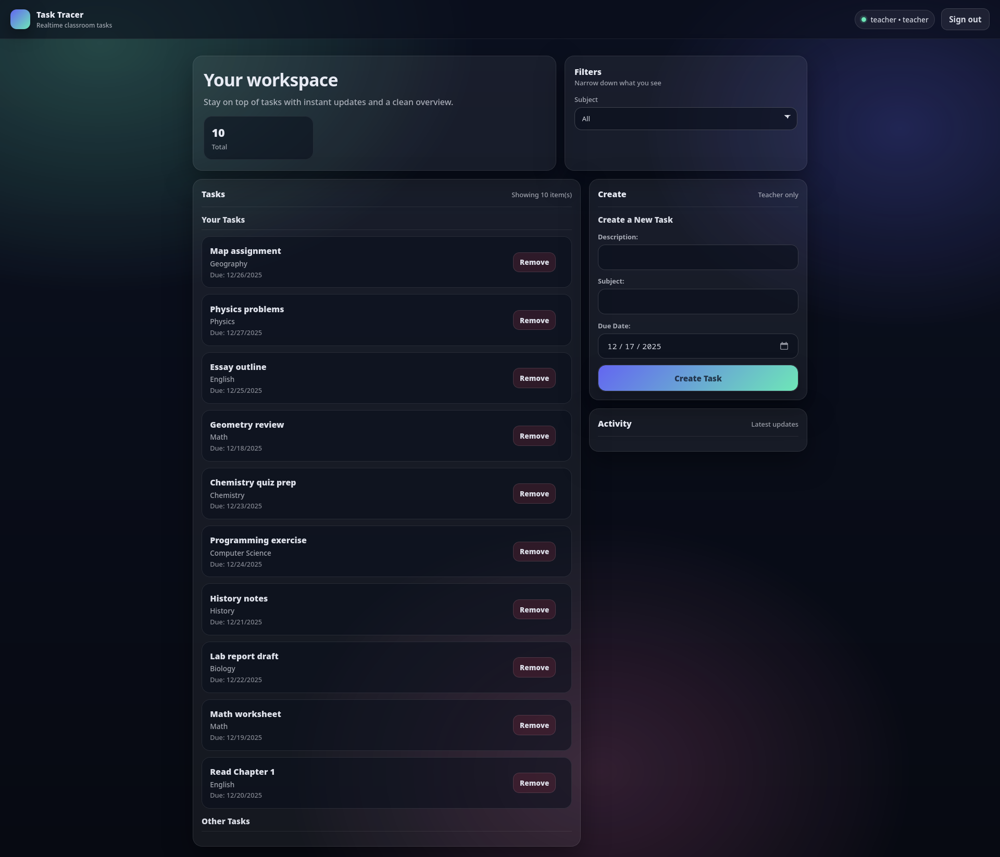

# Task Tracker (Docker)

## Obsah

- [Nasazení](#nasazení)
- [Testování](#testování)
- [Ukončení](#ukončení)
- [Architektura](#architektura)
- [Lokální vývoj bez Dockeru](#lokální-vývoj-bez-dockeru)
- [Konfigurace](#konfigurace)
- [Autentizace a role](#autentizace-a-role)
- [REST API](#rest-api)
- [Realtime (Socket.IO)](#realtime-socketio)
- [Redis model (klíče / struktury)](#redis-model-klíče--struktury)
- [Troubleshooting](#troubleshooting)

--

## Požadavky

- Docker
- Docker Compose
- Git

## Nasazení

```bash
git clone https://github.com/petr-svestka/task-tracer.git
cd task-tracker
docker-compose up --build -d
```

> Data z Redis jsou perzistentní v lokální složce `./redis-data` (bind mount).

### Přístup

- Frontend: http://localhost:3000
- RedisInsight (ladění): http://localhost:8001

## Testování

### 1) Seed – 10 testovacích úkolů
Spusťte seed skript, který vloží testovací uživatele a úkoly do Redis.

- vytvoří uživatele:
  - `teacher` / `1234` (role `teacher`)
  - `student` / `1234` (role `student`)
- vytvoří **10** veřejných (public) úkolů

```bash
docker-compose exec backend npm run seed
```

> Pozn.: pokud seed spustíte vícekrát, přidá se dalších 10 úkolů.

## Ukončení

Zastavení a smazání dat (včetně volumes):

```bash
docker-compose down -v
```

## Dokumentace

### Screenshoty
Login


Register


Student


Teacher


## Architektura

Projekt je složený ze tří služeb (viz `docker-compose.yml`):

- **redis**: `redis/redis-stack` (Redis + RedisInsight UI)
- **backend**: Node.js + Express (REST API) + Socket.IO
- **nginx**: statické servírování frontendu + reverse proxy pro `/api/*` a `/socket.io/*`

Porty (default):

- Frontend (nginx): http://localhost:3000
- Backend API (přímý přístup): http://localhost:5000
- Redis: `localhost:6379`
- RedisInsight UI: http://localhost:8001


---

## Konfigurace

### Backend (env)

Backend čte tyto proměnné prostředí:

- `PORT` (default `5000`) – port Express serveru
- `REDIS_HOST` (default `127.0.0.1`) – host Redis
- `REDIS_PORT` (default `6379`) – port Redis
- `JWT_SECRET` (default `dev-secret-change-me`) – HMAC secret pro JWT (HS256)
- `JWT_TTL_SECONDS` (default `604800` = 7 dní) – expirace tokenu
- `TASK_TTL_SECONDS` (default `2592000` = 30 dní) – TTL pro tasky a související klíče

V Docker Compose jsou hodnoty nastavené v `docker-compose.yml`.

### Frontend (env)

- `VITE_API_URL` (default `/api`) – base URL pro REST API
- `VITE_SOCKET_URL` (default odvozeno z `VITE_API_URL`) – base URL pro Socket.IO

V Docker režimu se volá přes nginx reverse proxy:

- `/api/*` → backend
- `/socket.io/*` → backend

---

## Autentizace a role

Aplikace používá JWT (HS256) a jednoduchou revokaci tokenů:

- Po loginu backend vrátí `token` + `user`.
- Frontend ukládá uživatele do `localStorage` pod klíč `authUser`.
- Každý request posílá `Authorization: Bearer <token>`.
- Backend navíc eviduje aktivní tokeny v Redis (klíč `token:<jwt>`); po `/auth/logout` se token smaže.

Role:

- `student` (default)
  - vidí úkoly
  - může si u úkolů přepínat dokončení (per‑user stav)
- `teacher`
  - může vytvářet úkoly
  - může mazat úkoly
  - **nemůže** označovat úkoly jako dokončené

---

## REST API

V Docker režimu se API volá přes nginx prefix `/api`.

- Příklad: `GET http://localhost:3000/api/tasks`

Při přímém volání backendu (bez nginx) je base bez prefixu:

- Příklad: `GET http://localhost:5000/tasks`

### Health

- `GET /health`
  - Ověří konektivitu na Redis.

### Auth

- `POST /auth/register`
  - Body: `{ "username": string, "password": string, "role"?: "student"|"teacher" }`
  - `role` je volitelné, default `student`.

- `POST /auth/login`
  - Body: `{ "username": string, "password": string }`
  - Response: `{ token: string, user: { id, username, role? } }`

- `POST /auth/logout` (auth)
  - Smaže token z Redis (revokace).

### Tasks

- `GET /tasks` (auth)
  - Vrací seznam úkolů viditelných pro uživatele.
  - Pro studenty se u úkolů pole `completed` dopočítává per‑user.
  - Pro učitele se u úkolů `completed` vrací vždy jako `false`.

- `POST /tasks` (auth, pouze teacher)
  - Vytvoří úkol.
  - Body: `{ "title": string, "subject": string, "finishDate": number }` (timestamp v ms)

- `PUT /tasks/:id` (auth)
  - Pokud je uživatel **owner** úkolu: může aktualizovat `title`, `subject`, `finishDate`, `completed`.
  - Pokud uživatel není owner: student může poslat pouze `{ "completed": boolean }` (per‑user completion).

- `DELETE /tasks/:id` (auth)
  - Úkol: může smazat pouze teacher, který ho vytvořil.

### Notifications (historie)

- `GET /notifications?count=30&from=<streamId>` (auth)
  - Vrací notifikace z Redis streamu `notifications`.
  - Server filtruje jen notifikace pro `userId == 0` (globální) nebo pro aktuálního uživatele.

---

## Realtime (Socket.IO)

Frontend se připojuje na Socket.IO a posílá token v handshake:

- `io(SOCKET_URL, { auth: { token } })`

Server:

- ověří JWT a připojí socket do roomu `user:<id>`
- bridge z Redis Pub/Sub kanálu `task-events` posílá eventy do:
  - všech (broadcast), pokud `userId` v eventu je `0`
  - konkrétního uživatele (room), pokud `userId` je ID uživatele

Event name do klienta:

- `task:event`

Typické payloady:

- `{ type: "task.created"|"task.updated"|"task.deleted", userId, taskId }`
- `{ type: "notification.created", userId, taskId, message, name?, subject? }`

Poznámka: Frontend má fallback – pokud websocket nejde (proxy/network), spustí polling každou 1 sekundu.

---

## Redis model (klíče / struktury)

Backend používá Redis Stack funkce (JSON + Streams) a běžné Redis struktury:

### Users

- `user:<id>` – **RedisJSON** dokument uživatele (`JSON.SET/GET`)
- `user:byUsername:<lowercase>` – mapování username → userId
- `seq:userId` – sekvence pro ID uživatele (`INCR`)

### Tasks

- `task:<id>` – **RedisJSON** dokument tasku + TTL (`EXPIRE`)
- `seq:taskId` – sekvence pro ID tasku (`INCR`)
- `tasks:user:<userId>` – sorted set, úkoly vytvořené uživatelem (score = `createdAt`)
- `tasks:public` – sorted set úkolů (score = `createdAt`)
- `task:completed:<taskId>` – set userId, kteří si označili úkol jako completed (per‑user)

### Tokens

- `token:<jwt>` – existence klíče znamená, že token je aktivní (TTL = `JWT_TTL_SECONDS`)

### Streams

- `notifications` – stream notifikací (historie pro UI)
- `task:history` – stream historických task eventů (audit)

### Pub/Sub

- `task-events` – kanál pro realtime bridge do Socket.IO

---

## Troubleshooting

- **UI se nenačítá přes Docker**: zkontrolujte, že běží `nginx` service a port `3000` není obsazen.
- **API vrací 401**: token je expirovaný nebo byl odhlášen; frontend vás přesměruje na `/login`.
- **Realtime nefunguje**: frontend automaticky přepne na polling (1s). Ověřte proxy pro `/socket.io`.
- **RedisInsight**: otevřete http://localhost:8001 a připojte se na `redis:6379` (v Docker síti) nebo `localhost:6379` (lokálně).