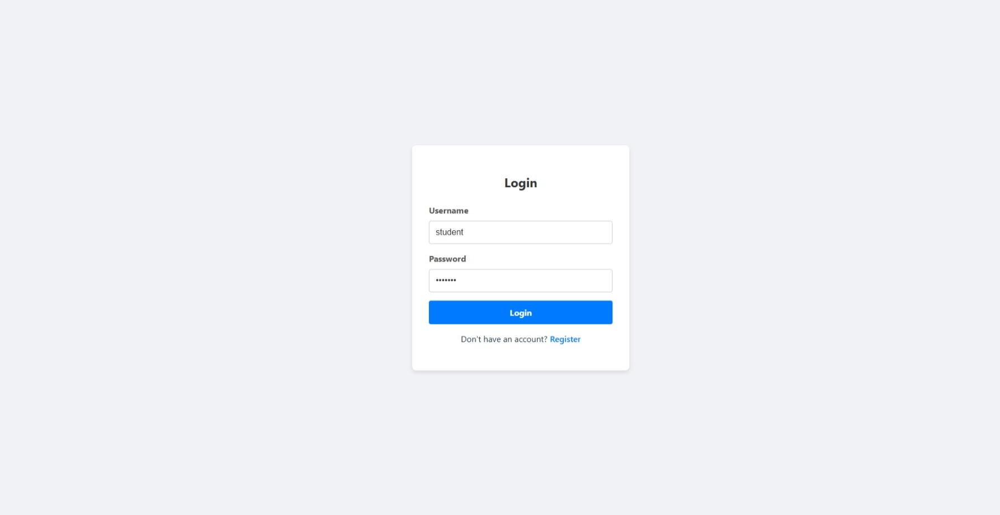
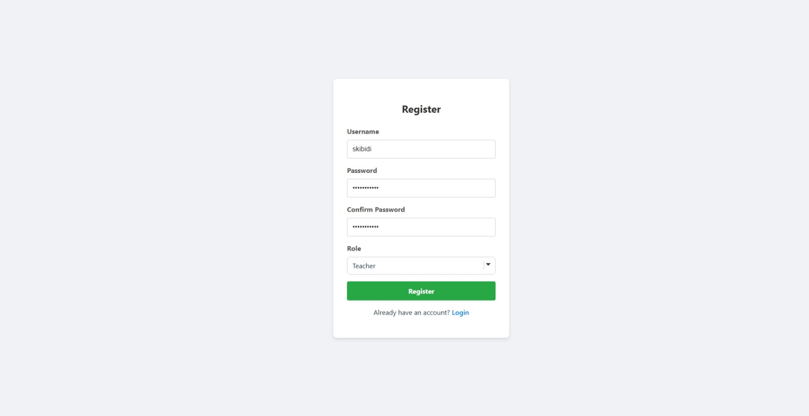
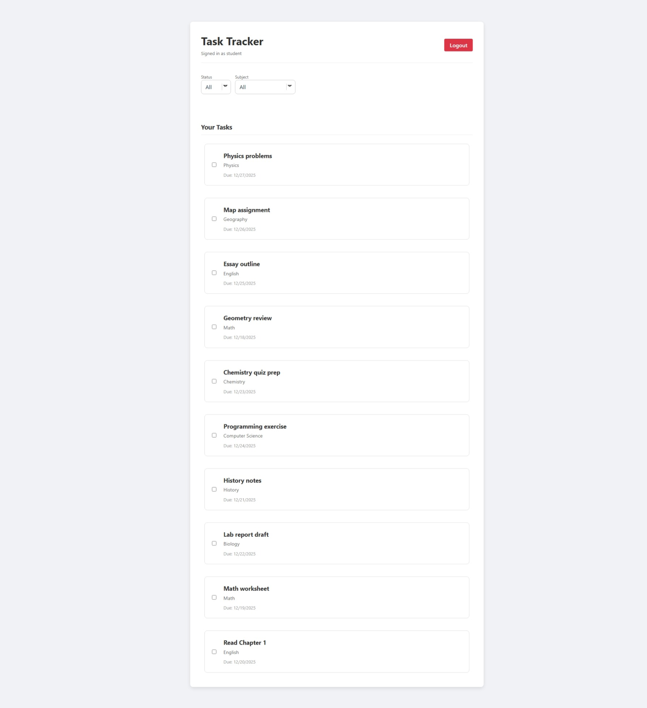
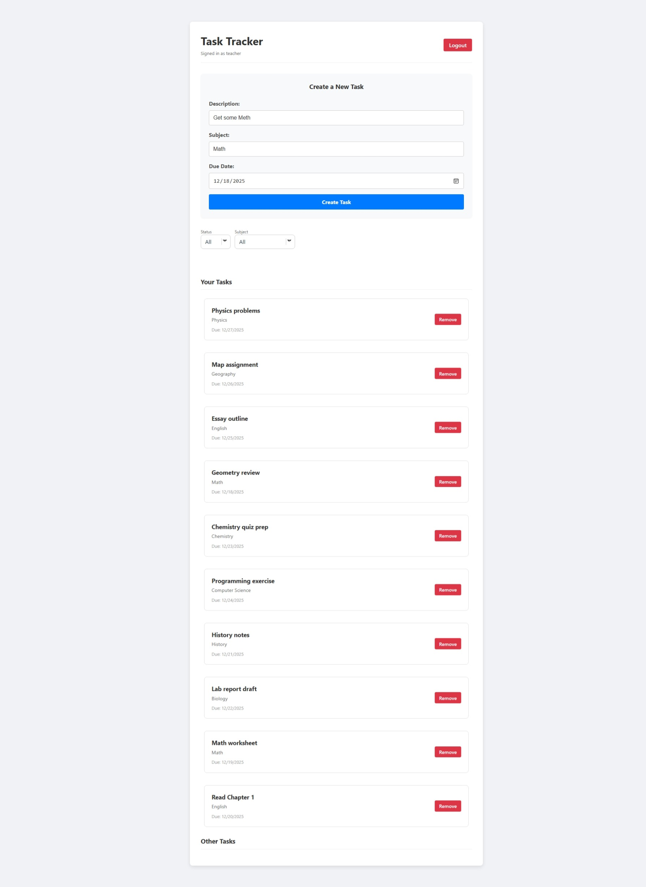
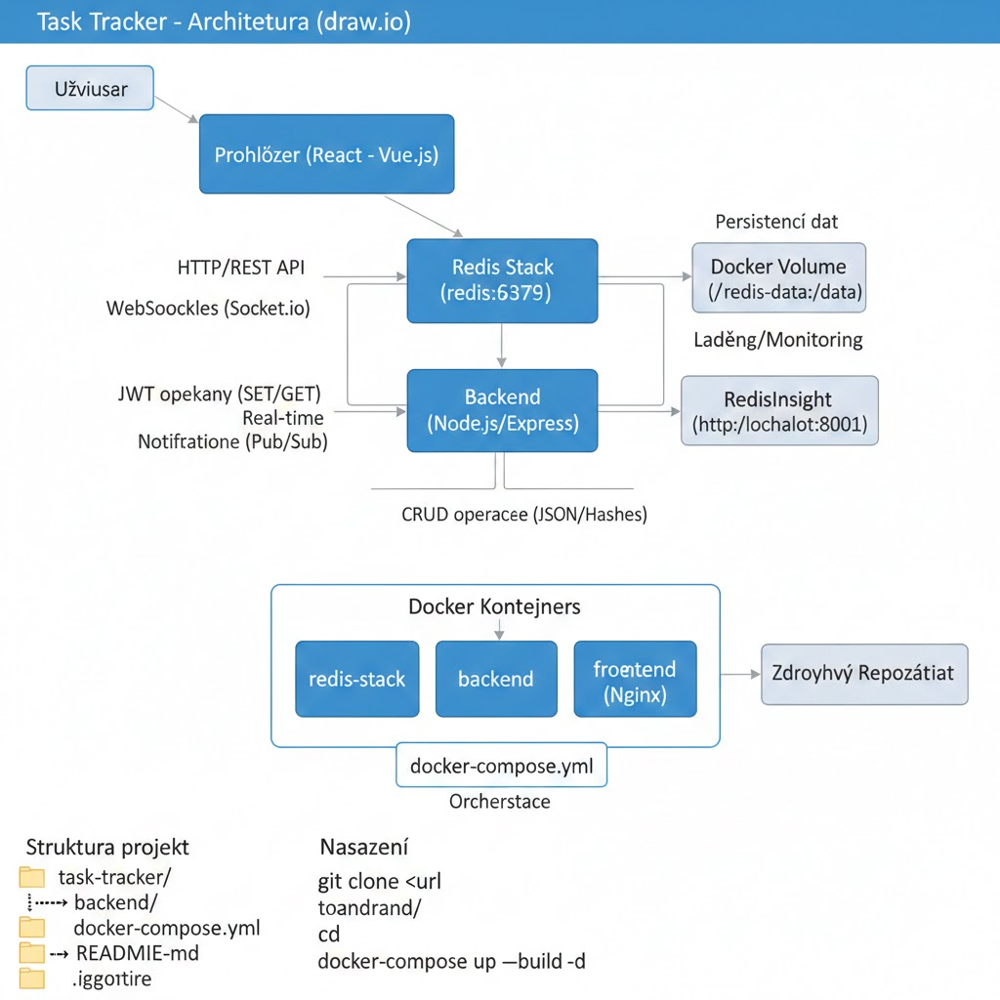
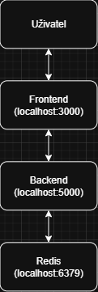
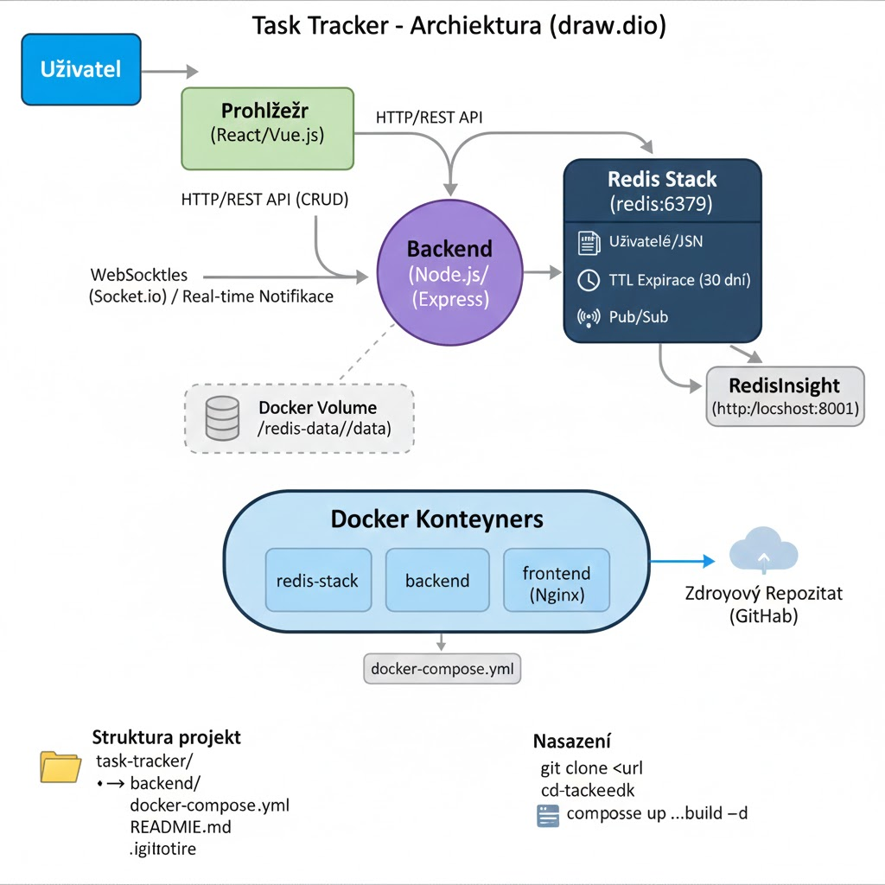
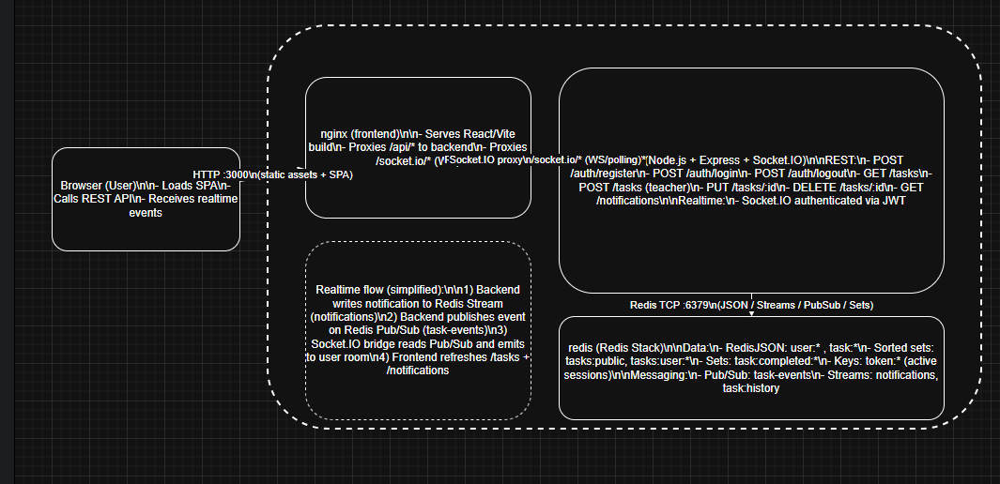

# Task Tracker (Docker)

## Požadavky

- Docker
- Docker Compose
- Git

## Nasazení

```bash
git clone https://github.com/petr-svestka/task-tracer.git
cd task-tracker
docker-compose up --build -d
```

> Data z Redis jsou perzistentní v lokální složce `./redis-data` (bind mount).

## Přístup

- Frontend: http://localhost:3000
- RedisInsight (ladění): http://localhost:8001

## Testování

### 1) Seed – 10 testovacích úkolů
Spusťte seed skript, který vloží testovací uživatele a úkoly do Redis.

- vytvoří uživatele:
  - `teacher` / `1234` (role `teacher`)
  - `student` / `1234` (role `student`)
- vytvoří **10** veřejných (public) úkolů

```bash
docker-compose exec backend npm run seed
```

> Pozn.: pokud seed spustíte vícekrát, přidá se dalších 10 úkolů.

### 2) Vyhledávání (Redis Search / RediSearch)
Backend vytváří RediSearch index nad úkoly (`task:*`) automaticky při startu.

Endpoint:

- `GET /tasks/search?q=<text>&subject=<subject>&limit=<n>&offset=<n>`

V Docker režimu přes nginx prefix (UI volá `/api/*`):

- `GET http://localhost:3000/api/tasks/search?q=math&subject=Math`

Response:

- `{ total: number, items: Task[] }`

## Ukončení

Zastavení a smazání dat (včetně volumes):

```bash
docker-compose down -v
```

## Dokumentace

### Screenshoty
Login


Register


Student


Teacher



### Diagram architektury






Oops, mě upadly AI generated diagramy a ten reálný se do nich zamíchal.